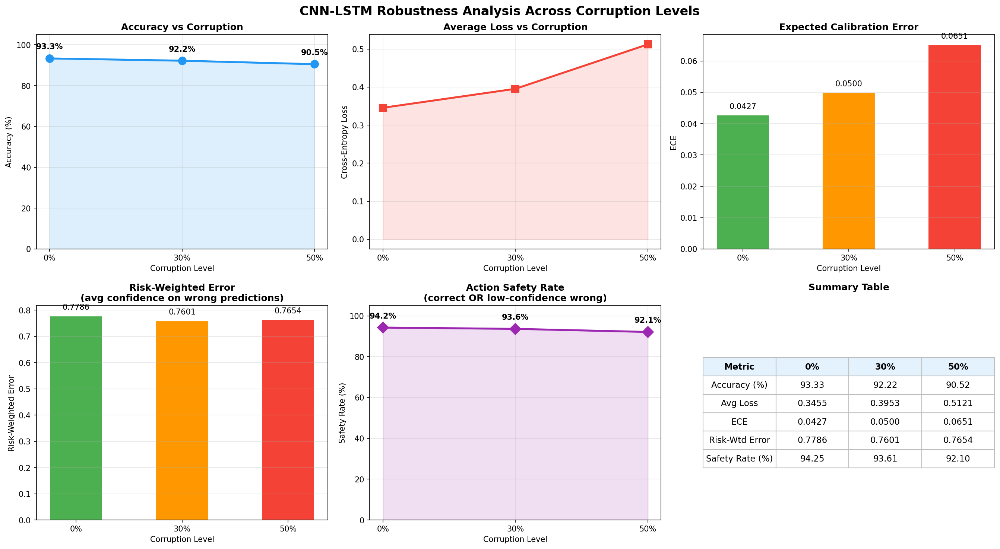
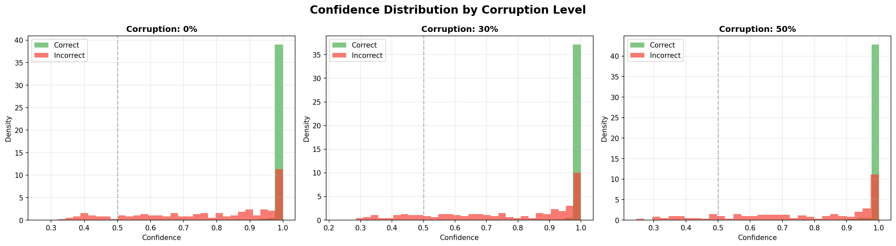
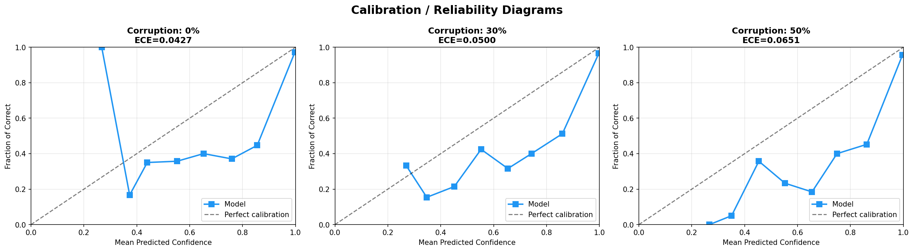
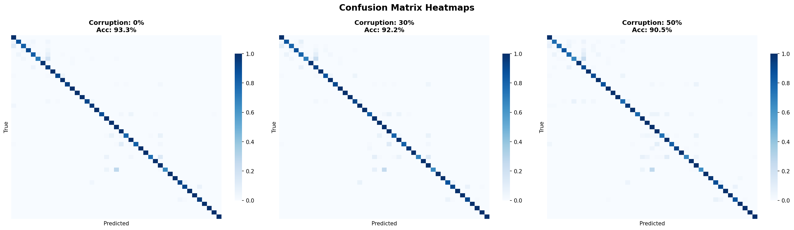
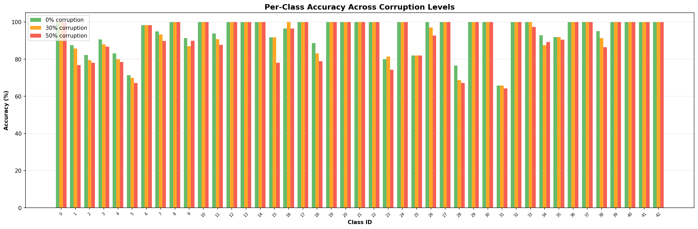

# CNN-LSTM Model Evaluation Report
## Traffic Sign Recognition with Adversarial Robustness

---

## 1. Executive Summary

This report evaluates the CNN-LSTM temporal model on the GTSRB (German Traffic Sign Recognition Benchmark) dataset under varying levels of adversarial corruption (0%, 30%, 50%). The model uses a ResNet-18 backbone for per-frame feature extraction followed by an LSTM for temporal reasoning.

---

## 2. Evaluation Metrics

| Metric | Description |
|--------|-------------|
| **Accuracy** | Standard classification accuracy |
| **Robustness** | Accuracy retention under adversarial corruption |
| **ECE** | Expected Calibration Error — measures confidence-accuracy alignment |
| **Risk-Weighted Error** | Average confidence on incorrect predictions (lower = safer failures) |
| **Action Safety Rate** | % of predictions that are either correct OR low-confidence wrong (model "abstains") |

---

## 3. Results Summary

| Corruption | Accuracy | Loss | ECE | Risk-Wtd Error | Safety Rate |
|:----------:|:--------:|:----:|:---:|:--------------:|:-----------:|
| 0% | 93.33% | 0.3455 | 0.0427 | 0.7786 | 94.25% |
| 30% | 92.22% | 0.3953 | 0.0500 | 0.7601 | 93.61% |
| 50% | 90.52% | 0.5121 | 0.0651 | 0.7654 | 92.10% |

---

## 4. Key Findings

### 4.1 Robustness
- **30% corruption**: Accuracy drops by **1.11pp** from clean baseline
- **50% corruption**: Accuracy drops by **2.82pp** from clean baseline

### 4.2 Uncertainty Calibration
- **0% corruption**: ECE = 0.0427
- **30% corruption**: ECE = 0.0500
- **50% corruption**: ECE = 0.0651

### 4.3 Action Safety
- **0% corruption**: Safety Rate = 94.25%
- **30% corruption**: Safety Rate = 93.61%
- **50% corruption**: Safety Rate = 92.10%

---

## 5. Visualizations

### 5.1 Attention Heatmaps

Saliency-based attention maps showing where the model focuses for clean vs attacked frames.

### 5.2 Robustness Curves

Multi-metric degradation across corruption levels.

### 5.3 Confidence Distributions

Separation of confidence scores between correct and incorrect predictions.

### 5.4 Calibration Diagrams

Reliability diagrams showing model calibration quality.

### 5.5 Confusion Matrices

Normalized confusion matrices showing misclassification patterns.

### 5.6 Per-Class Robustness

Per-class accuracy breakdown across corruption levels.

---

## 6. Methodology

- **Dataset**: GTSRB, 350 images/class, 80/20 train/val split
- **Sequence generation**: 8 frames with random rotation (±10°) and brightness (0.8–1.2x)
- **Attack**: Central noise patch (50% of frame area) applied to fraction of frames
- **Corruption levels**: 0% (clean), 30%, 50% of frames corrupted
- **Safety threshold**: 0.5 confidence for action safety rate computation

---

*Report generated automatically by evaluate_cnn_lstm.py*
